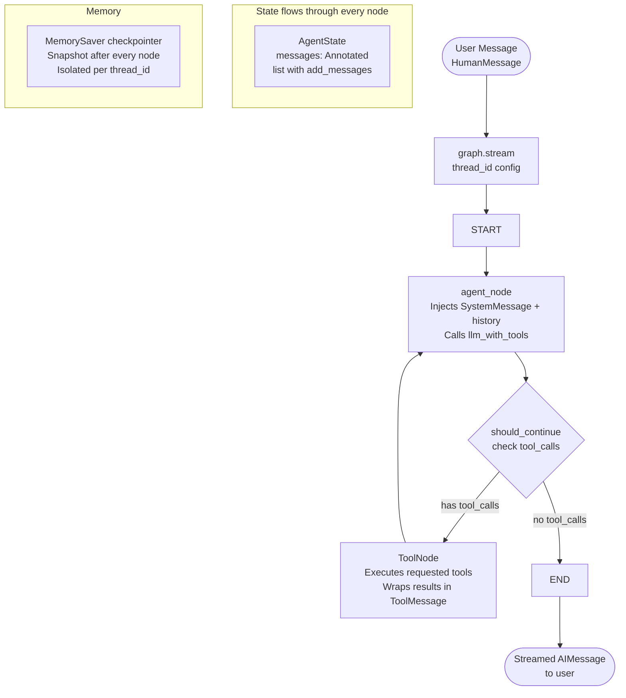
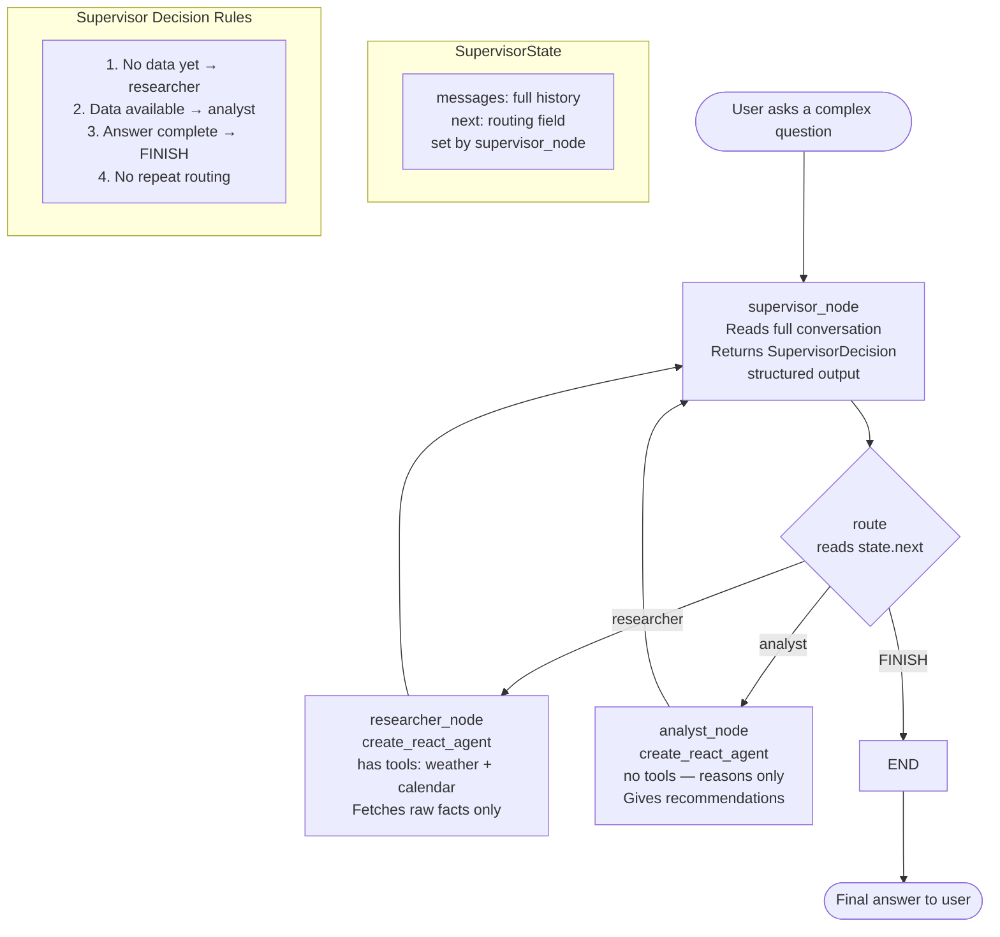
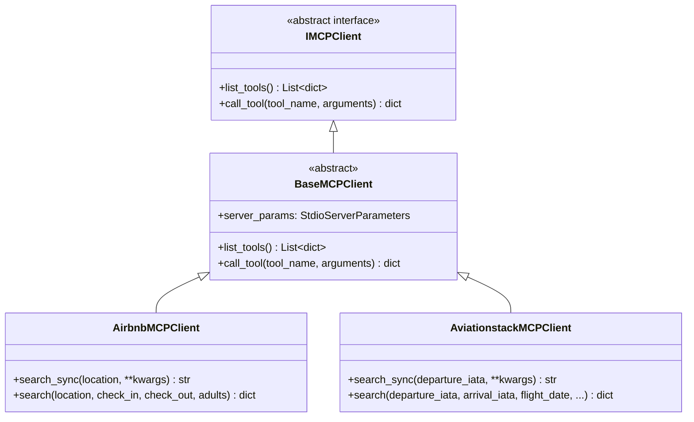
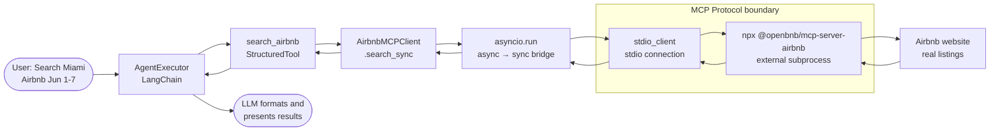
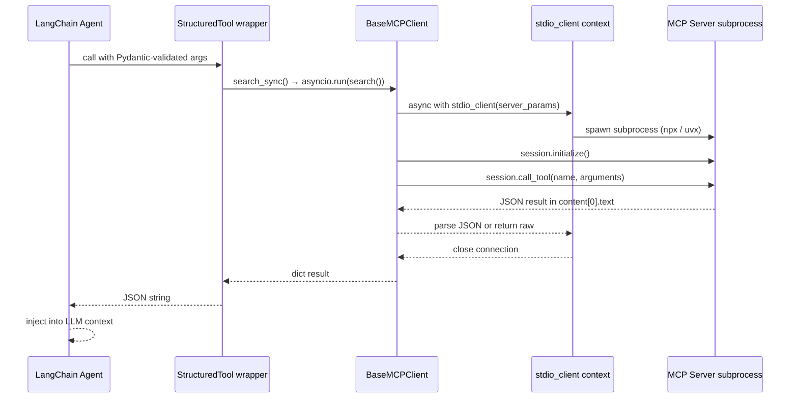
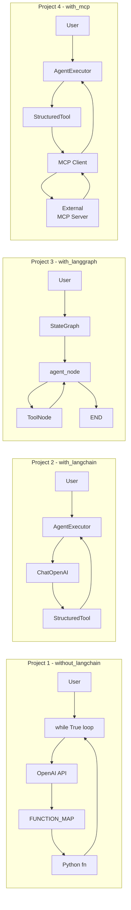

# WORKFLOW.md — AI Projects: Use Cases, Architectures & Flows

This document explains every project in this repo — what problem it solves, how it solves it, and how the pieces fit together visually.

---

## Overview: The Big Picture

This repo is a **progressive learning track** for building production-grade AI agents. All four projects solve the same core problem (a conversational assistant that can call external tools), but each one adds a new layer of abstraction or capability. Reading them in order shows you exactly what each framework buys you.

```
┌─────────────────────────────────────────────────────────────────────┐
│  PROGRESSION: Raw → Abstracted → Graph-based → Protocol-connected  │
│                                                                     │
│  without_langchain  →  with_langchain  →  with_langgraph  →  with_mcp │
│  (full manual)         (framework)        (state machine)    (external servers) │
└─────────────────────────────────────────────────────────────────────┘
```

---

## Project 1: `without_langchain/` — Raw OpenAI Agent

### Use Case
Build a **weather + calendar assistant** that can answer multi-turn questions like:
- *"What's the weather in Tampa and what meetings do I have today?"*
- *"Is it a good day to hold the 9am meeting outside?"* (requires memory from turn 1)
- *"What's on my calendar for the 25th of April?"* (triggers error recovery)

### How It's Solved
Everything is written by hand using only the OpenAI Python SDK. No frameworks. This is the "ground truth" — you see every mechanism that frameworks later hide from you.

| What it does | How it's built |
|---|---|
| Talk to the LLM | `openai.OpenAI()` + `client.chat.completions.create()` |
| Define tools | Manually written JSON schemas in a `TOOLS` list |
| Route tool calls | `FUNCTION_MAP` dict (`fn_name → callable`) |
| Run the agent loop | `while True:` with manual iteration counting |
| Stream responses | Manual chunk accumulation (`for chunk in stream`) |
| Remember conversation | `chat_history = []` list, manually appended |
| Enforce tool timeouts | `@with_timeout` decorator using `signal.SIGALRM` |
| Handle tool errors | `@with_error_recovery` decorator returns errors as strings |

### Flow Diagram

```mermaid
flowchart TD
    A([User Input]) --> B[Build messages list\nsystem + chat_history + user]
    B --> C{while True\nAgent Loop}
    C --> D[OpenAI Streaming API\ngpt-4o + TOOLS]
    D --> E{Tool calls\nrequested?}
    E -- No --> F[Append to chat_history\nReturn final answer]
    F --> G([User sees response])
    E -- Yes --> H[Parse tool_calls\nfrom streamed chunks]
    H --> I{FUNCTION_MAP\nlookup}
    I --> J[@with_timeout\n5 second limit]
    J --> K[@with_error_recovery\ncatch all exceptions]
    K --> L[Execute tool function\nget_weather / get_calendar]
    L --> M[Append ToolMessage\nto messages]
    M --> N{iterations >=\nMAX_ITERATIONS?}
    N -- No --> C
    N -- Yes --> O([Stop: max iterations])
    C --> P{elapsed >\nAGENT_TIMEOUT?}
    P -- Yes --> Q([Stop: timeout])
```

---

## Project 2: `with_langchain/` — LangChain Agent

### Use Case
Same weather + calendar assistant as Project 1, but now the **framework handles all the plumbing**. This project teaches you what LangChain replaces — and why you'd use it.

### How It's Solved
LangChain's `AgentExecutor` takes over the agent loop, tool routing, memory, and streaming. Tools are defined using Pydantic schemas instead of hand-written JSON. Each tool is its own module.

| What LangChain replaces | LangChain equivalent |
|---|---|
| Handwritten JSON tool schemas | `StructuredTool` + Pydantic `BaseModel` |
| `FUNCTION_MAP` + manual routing | `AgentExecutor` (automatic) |
| `while True` agent loop | `AgentExecutor` (automatic) |
| `chat_history = []` | `ConversationBufferMemory` |
| Manual streaming chunks | `streaming=True` + `StreamingStdOutCallbackHandler` |
| `if iterations >= MAX_ITERATIONS` | `max_iterations=5` parameter |
| `try/except json.JSONDecodeError` | `handle_parsing_errors=...` parameter |

### Package Structure

```
with_langchain/
├── agent.py          ← LLM + memory + prompt + AgentExecutor setup
├── utils.py          ← Shared @with_timeout and @with_error_recovery
└── tools/
    ├── __init__.py   ← Collects all tools into a single list
    ├── weather.py    ← WeatherInput schema + StructuredTool
    └── calendar.py   ← CalendarInput schema + StructuredTool
```

### Flow Diagram

```mermaid
flowchart TD
    A([User Input]) --> B[AgentExecutor.invoke\ninput + today date]
    B --> C[ChatPromptTemplate\nsystem + chat_history + human + scratchpad]
    C --> D[ChatOpenAI gpt-4o\nstreaming + callback]
    D --> E{AgentExecutor\ninternal loop}
    E --> F{Tool calls\nrequested?}
    F -- No --> G[ConversationBufferMemory\nauto-saves turn]
    G --> H([User sees streamed response])
    F -- Yes --> I[AgentExecutor routes\nto correct StructuredTool]
    I --> J[StructuredTool.func\nvalidated by Pydantic]
    J --> K[@with_timeout + @with_error_recovery\nfrom utils.py]
    K --> L[Tool executes\nget_weather / get_calendar]
    L --> M[Result injected into\nagent_scratchpad]
    M --> E
    E --> N{max_iterations\nor max_execution_time?}
    N -- Yes --> O([Graceful stop with error message])

    subgraph Tools Package
        P[tools/__init__.py\ntools list] --> Q[weather.py\nWeatherInput + StructuredTool]
        P --> R[calendar.py\nCalendarInput + StructuredTool]
    end
```

---

## Project 3: `with_langgraph/` — LangGraph Explicit Graph Agent + Supervisor

### Use Case
Same weather + calendar assistant, now built as an **explicit state machine**. This project introduces two patterns:

1. **Single ReAct Agent** (`graph.py` + `agent.py`) — same assistant, now with a visible, inspectable graph topology instead of a hidden `AgentExecutor` loop.
2. **Multi-Agent Supervisor** (`supervisor.py`) — a more advanced pattern where a **Supervisor** orchestrates two specialist agents (Researcher and Analyst) to answer the user's question in stages.

### Why LangGraph Over LangChain?
- You can **see and control the full topology** — who runs when and why
- **Thread-based memory** via `MemorySaver` — multiple parallel conversations, no state collision
- **Human-in-the-loop** — you can pause, inspect state, and resume at any checkpoint
- **Multi-agent orchestration** — natural fit for supervisor/specialist patterns
- Foundation for **LangSmith** (observability), **LangServe** (deployment), **LangFlow** (visual builder)

### Core Concepts

| Concept | What it does |
|---|---|
| `StateGraph` | The graph builder — registers nodes and edges |
| `AgentState` (TypedDict) | Shared state with `add_messages` reducer (appends, never replaces) |
| `agent_node` | Calls the LLM; returns new messages |
| `ToolNode` | Prebuilt node that executes tools from `tool_calls` |
| `should_continue` | Conditional edge function — routes to `tools` or `END` |
| `MemorySaver` | Stores state snapshots per `thread_id` — no `ConversationBufferMemory` needed |
| `graph.stream()` | Yields full state after each node execution |
| `graph.get_state()` | Inspect full conversation + next node (unique to LangGraph) |

### Single Agent Flow Diagram



### Multi-Agent Supervisor Flow Diagram



---

## Project 4: `with_mcp/` — LangChain Agent with MCP Tool Servers

### Use Case
Build a **travel assistant** that can search real Airbnb listings and live flight data. Unlike the previous projects where tools are just Python functions returning mock strings, here the tools are **external MCP (Model Context Protocol) servers** running as subprocesses.

- *"Search for Airbnb listings in Miami for 2 adults, June 1–7 2026"*
- *"Show me flights from JFK to Miami on June 1st 2026"*
- *"What airlines fly that route?"* (memory from prior turns)

### What Is MCP?
MCP (Model Context Protocol) is a standard protocol for connecting AI agents to external tools and data sources. A tool isn't just a Python function — it's a **server** that speaks a standard protocol over `stdio`. The agent doesn't need to know how the tool is implemented; it just sends requests and receives responses.

### How It's Solved
The project layers three things:

1. **MCP Client Layer** (`mcps/`) — Python classes that speak the MCP stdio protocol to external tool servers
2. **LangChain Wrapper Layer** (`agent.py`) — wraps MCP clients as `StructuredTool` instances so LangChain's agent can call them
3. **LangChain Agent** (`agent.py`) — same `AgentExecutor` pattern as Project 2, but tools now call live MCP servers

### Class Hierarchy



### End-to-End Data Flow



### MCP Session Flow (per tool call)



---

## Cross-Project Comparison



| Concern | Project 1 | Project 2 | Project 3 | Project 4 |
|---|---|---|---|---|
| Tool schema | Hand-written JSON | Pydantic + StructuredTool | `@tool` decorator | Pydantic + StructuredTool |
| Tool routing | `FUNCTION_MAP` dict | AgentExecutor | `ToolNode` (prebuilt) | AgentExecutor |
| Agent loop | `while True:` | AgentExecutor | StateGraph edges | AgentExecutor |
| Memory | `chat_history = []` | `ConversationBufferMemory` | `MemorySaver` (per thread) | `ConversationBufferMemory` |
| Streaming | Manual chunk loop | `StreamingStdOutCallbackHandler` | `graph.stream()` | `StreamingStdOutCallbackHandler` |
| Tool execution | Direct Python call | StructuredTool.func | ToolNode subprocess | MCP stdio protocol |
| State visibility | Hidden in loop | Hidden in executor | Fully explicit graph | Hidden in executor |
| Multi-agent | No | No | Yes (Supervisor pattern) | No |
| External servers | No | No | No | Yes (npx, uvx) |
